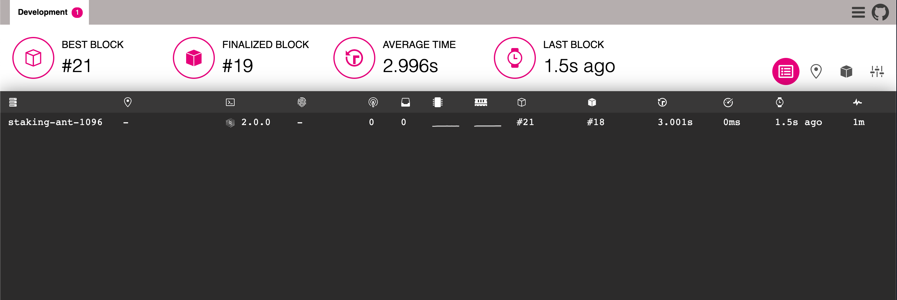

# Polkadot Telemetry

## Overview

This repository contains the backend ingestion server for Substrate Telemetry (which itself is comprised of two binaries; `telemetry_shard` and `telemetry_core`) as well as the Frontend you typically see running at [telemetry.polkadot.io](https://telemetry.polkadot.io/).

The backend is a Rust project and the frontend is React/Typescript project.

Substrate based nodes can be connected to an arbitrary Telemetry backend using the `--telemetry-url` (see below for more complete instructions on how to get this up and running).

### Messages

Depending on the configured verbosity, substrate nodes will send different types of messages to the Telemetry server. Verbosity level `0` is sufficient to provide the Telemetry server with almost all of the node information needed. Using this verbosity level will lead to the substrate node sending the following message types to Telemetry:

```
system.connected
system.interval
block.import
notify.finalized
```

Increasing the verbosity level to 1 will lead to additional "consensus info" messages being sent, one of which has the identifier:

```
afg.authority_set
```

Which we use to populate the "validator address" field if applicable.

Increasing the verbosity level beyond 1 is unnecessary, and will not result in any additional messages that Telemetry can handle (but other metric gathering systems might find them useful).

## Getting Started

To run the backend, you will need `cargo` to build the binary. We recommend using [`rustup`](https://rustup.rs/).

To run the frontend make sure to grab the latest stable version of node and install dependencies before doing anything:

```sh
nvm install stable
(cd frontend && npm install)
```

### Terminal 1 & 2 - Backend

Build the backend binaries by running the following:

```
cd backend
cargo build --release
```

And then, in two different terminals, run:

```
./target/release/telemetry_core
```

and

```
./target/release/telemetry_shard
```

Use `--help` on either binary to see the available options.

By default, `telemetry_core` will listen on 127.0.0.1:8000, and `telemetry_shard` will listen on 127.0.0.1:8001, and expect the `telemetry_core` to be listening on its default address. To listen on different addresses, use the `--listen` option on either binary, for example `--listen 0.0.0.0:8000`. The `telemetry_shard` also needs to be told where the core is, so if the core is configured with `--listen 127.0.0.1:9090`, remember to pass `--core 127.0.0.1:9090` to the shard, too.

### Terminal 3 - Frontend

```sh
cd frontend
npm install
npm run start
```

Once this is running, you'll be able to navigate to [http://localhost:3000](http://localhost:3000) to view the UI.

### Terminal 4 - Node

Follow up installation instructions from the [Polkadot repo](https://github.com/paritytech/polkadot)

If you started the backend binaries with their default arguments, you can connect a node to the shard by running:

```sh
polkadot --dev --telemetry-url 'ws://localhost:8001/submit 0'
```

**Note:** The "0" at the end of the URL is a verbosity level, and not part of the URL itself. Verbosity levels range from 0-9, with 0 denoting the lowest verbosity. The URL and this verbosity level are parts of a single argument and must therefore be surrounded in quotes (as seen above) in order to be treated as such by your shell.

## Docker

### Building images

To build the backend docker image, navigate into the `backend` folder of this repository and run:

```
docker build -t parity/substrate-telemetry-backend .
```

The backend image contains both the `telemetry_core` and `telemetry_shard` binaries.

To build the frontend docker image, navigate into the `frontend` folder and run:

```
docker build -t parity/substrate-telemetry-frontend .
```

### Run the backend and frontend using `docker-compose`

The easiest way to run the backend and frontend images is to use `docker-compose`. To do this, run `docker-compose up` in the root of this repository to build and run the images. Once running, you can view the UI by navigating a browser to `http://localhost:3000`.

To connect a substrate node and have it send telemetry to this running instance, you have to tell it where to send telemetry by appending the argument `--telemetry-url 'ws://localhost:8001/submit 0'` (see "Terminal 4 - Node" above).

### Run the backend and frontend using `docker`

If you'd like to get things running manually using Docker, you can do the following. This assumes that you've built the images as per the above, and have two images named `parity/substrate-telemetry-backend` and `parity/substrate-telemetry-frontend`.

1. Create a new shared network so that the various containers can communicate with eachother:

   ```
   docker network create telemetry
   ```

2. Start up the backend core process. We expose port 8000 so that a UI running in a host browser can connect to the `/feed` endpoint.

   ```
   docker run --rm -it --network=telemetry \
       --name backend-core \
       -p 8000:8000 \
       --read-only \
       parity/substrate-telemetry-backend \
       telemetry_core -l 0.0.0.0:8000
   ```

3. In another terminal, start up the backend shard process. We tell it where it can reach the core to send messages (possible because it has been started on the same network), and we listen on and expose port 8001 so that nodes running in the host can connect and send telemetry to it.

   ```
   docker run --rm -it --network=telemetry \
       --name backend-shard \
       -p 8001:8001 \
       --read-only \
       parity/substrate-telemetry-backend \
       telemetry_shard -l 0.0.0.0:8001 -c http://backend-core:8000/shard_submit
   ```

4. In another terminal, start up the frontend server. We pass a `SUBSTRATE_TELEMETRY_URL` env var to tell the UI how to connect to the core process to receive telemetry. This is relative to the host machine, since that is where the browser and UI will be running.

   ```
   docker run --rm -it --network=telemetry \
       --name frontend \
       -p 3000:8000 \
       -e SUBSTRATE_TELEMETRY_URL=ws://localhost:8000/feed \
       parity/substrate-telemetry-frontend
   ```

   **NOTE:** Here we used `SUBSTRATE_TELEMETRY_URL=ws://localhost:8000/feed`. This will work if you test with everything running locally on your machine but NOT if your backend runs on a remote server. Keep in mind that the frontend docker image is serving a static site running your browser. The `SUBSTRATE_TELEMETRY_URL` is the WebSocket url that your browser will use to reach the backend. Say your backend runs on a remote server at `foo.example.com`, you will need to set the IP/url accordingly in `SUBSTRATE_TELEMETRY_URL` (in this case, to `ws://foo.example.com/feed`).

   **NOTE:** Running the frontend container in *read-only* mode reduces attack surface that could be used to exploit
   a container. It requires however a little more effort and mounting additional volumes as shown below:

   ```
   docker run --rm -it -p 80:8000 --name frontend \
      -e SUBSTRATE_TELEMETRY_URL=ws://localhost:8000/feed \
      --tmpfs /var/cache/nginx:uid=101,gid=101 \
      --tmpfs /var/run:uid=101,gid=101 \
      --tmpfs /app/tmp:uid=101,gid=101 \
      --read-only \
      parity/substrate-telemetry-frontend
   ```

With these running, you'll be able to navigate to [http://localhost:3000](http://localhost:3000) to view the UI. If you'd like to connect a node and have it send telemetry to your running shard, you can run the following:

```sh
docker run --rm -it --network=telemetry \
  --name substrate \
  -p 9944:9944 \
  chevdor/substrate \
  substrate --dev --telemetry-url 'ws://backend-shard:8001/submit 0'
```

You should now see your node showing up in your local [telemetry frontend](http://localhost:3000/):



## Deployment

This section covers the internal deployment of Substrate Telemetry to our staging and live environments.

### Deployment to staging

Every time new code is merged to `master`, a new version of telemetry will be automatically built and deployed to our staging environment, so there is nothing that you need to do. Roughly what will happen is:

- An image tag will be generated that looks like `$CI_COMMIT_SHORT_SHA-beta`, for example `224b1fae-beta`.
- Docker images for the frontend and backend will be pushed to the docker repo (see https://hub.docker.com/r/parity/substrate-telemetry-backend/tags?page=1&ordering=last_updated and https://hub.docker.com/r/parity/substrate-telemetry-frontend/tags?page=1&ordering=last_updated).
- A deployment to the staging environment will be performed using these images. Go to https://gitlab.parity.io/parity/substrate-telemetry/-/pipelines to inspect the progress of such deployments.

### Deployment to live

Once we're happy with things in staging, we can do a deployment to live as follows:

1. Ensure that the PRs you'd like to deploy are merged to master.
2. Tag the commit on `master` that you'd like to deploy with the form `v1.0-a1b2c3d`.
   - The version number (`1.0` here) should just be incremented from whatever the latest version found using `git tag` is. We don't use semantic versioning or anything like that; this is just a dumb "increment version number" approach so that we can see clearly what we've deployed to live and in what order.
   - The suffix is a short git commit hash (which can be generated with `git rev-parse --short HEAD`), just so that it's really easy to relate the built docker images back to the corresponding code.
3. Pushing the tag (eg `git push origin v1.0-a1b2c3d`) will kick off the deployment process, which in this case will also lead to new docker images being built. You can view the progress at https://gitlab.parity.io/parity/substrate-telemetry/-/pipelines.
4. Once a deployment to staging has been successful, run whatever tests you need against the staging deployment to convince yourself that you're happy with it.
5. Visit the CI/CD pipelines page again (URl above) and click the "play" button on the "Deploy-production" stage to perform the deployment to live.
6. Confirm that things are working once the deployment has finished by visiting https://telemetry.polkadot.io/.

### Rolling back to a previous deployment

If something goes wrong running the above, we can roll back the deployment to live as follows.

1. Decide what image tag you'd like to roll back to. Go to https://hub.docker.com/r/parity/substrate-telemetry-backend/tags?page=1&ordering=last_updated and have a look at the available tags (eg `v1.0-a1b2c3d`) to select one you'd like. You can cross reference this with the tags available using `git tag` in the repository to help see which tags correspond to which code changes.
2. Navigate to https://gitlab.parity.io/parity/substrate-telemetry/-/pipelines/new.
3. Add a variable called `FORCE_DEPLOY` with the value `true`.
4. Add a variable called `FORCE_DOCKER_TAG` with a value corresponding to the tag you want to deploy, eg `v1.0-a1b2c3d`. Images must exist already for this tag.
5. Hit 'Run Pipeline'. As above, a deployment to staging will be carried out, and if you're happy with that, you can hit the "play" button on the "Deploy-production" stage to perform the deployment to live.
6. Confirm that things are working once the deployment has finished by visiting https://telemetry.polkadot.io/.
